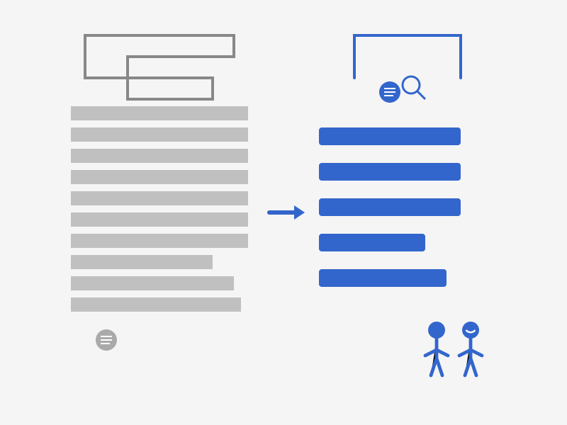

# Plain language
## How it can improve readability and usability
### by Bartek Biedrzycki

An Uczelnia Vistula final project for the Technical Communication course.

**Paper topic**: Why should we adapt the language to fit the needs of technical communication?

**Aim**: Introduce the concept of plain language and help writers switch to technical writing.

**Reader persona**: Aspiring/novice technical writers; 20-30yo for a novice, 40+ for people switching jobs on the current market; both male and female.

Formats available: HTML (markdown+github pages) / formatted PDF ([download](assets/Bartek_Biedrzycki-Plain_language.pdf))

Version: 1.0 (2025-05-22)

| Author:  | Bartek Biedrzycki |
| :---- | :---- |
| Supervisor: | Tomasz Prus |
| Reviewer 1: | Magdalena Żaczek |
| Reviewer 2: | Beata Skoczylas |

Konstancin-Jeziorna, 2025

License: [Creative Commons Atribution Non-commercial Share Alike](https://creativecommons.org/licenses/by-nc-sa/4.0/)

